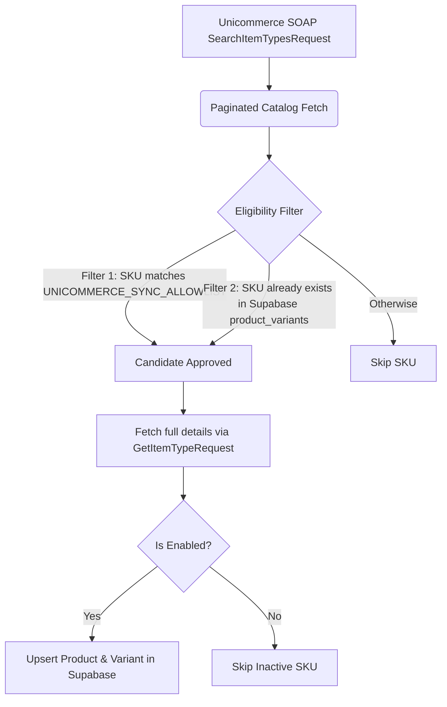

# Product Sync Strategy

This document outlines the selection and filtering criteria used during the synchronization of products between Unicommerce (Uniware) and our storefront database (Supabase).

## Objective
To ensure only active, storefront-eligible products are synchronized and updated in Supabase, preventing catalog clutter, reducing API load, and saving database storage.

## Filtering Mechanism

### 1. Candidate Retrieval (Metadata Scan)
We query the Unicommerce catalog using `SearchItemTypesRequest` in paginated pages of 100 items. This retrieves the metadata (SKU code, name, description, category, and base price) for all items in the catalog.

### 2. Storefront Eligibility Filtering
To bypass importing the full 6,000+ item catalog, we filter candidates using two criteria:
*   **SKU Allowlist Match**: The SKU code must match one of the comma-separated patterns configured in the `UNICOMMERCE_SYNC_ALLOWLIST` environment variable. By default, it falls back to the core storefront SKU patterns:
    *   `ctt-waffle`
    *   `black-warrior`
    *   `inspired`
    *   `star-tank-dark`
    *   `carpenter-grey`
    *   `stick-no-bills`
    *   `warrior-bob`
    *   `IK5737-M`
    *   `IK5738-M`
    *   `IK5745-M`
*   **Existing Database Products**: If a SKU already exists in the Supabase `product_variants` table, it is automatically approved as a candidate to ensure its prices and stock continue syncing correctly.

### 3. Precise Verification & Validation
For the matched storefront candidates, we make a detailed `GetItemTypeRequest` call to obtain the true, authoritative status.
*   **Enabled Status**: We verify that the product's `enabled` flag is `true`. Any draft, archived, or inactive products are skipped.
*   **Storefront Insertion**: Only products passing all criteria are upserted into the `products` and `product_variants` tables in Supabase.
