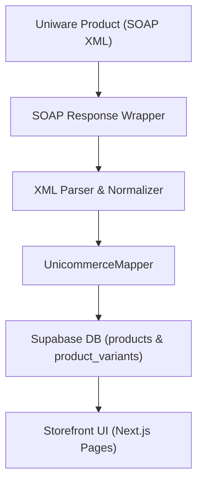

# Unicommerce Mapping Audit & Schema Report

This audit documents how catalog and inventory data flow between Unicommerce (SOAP XML API) and the Supabase PostgreSQL database tables: `products`, `product_variants`, and `inventory`.

---

## 1. Core Architecture Questions

### Where is the Uniware SKU stored?
*   **Location**: `product_variants.sku` (TEXT column in the database).
*   **Details**: Every unique variant synced from Unicommerce has its full `SkuCode` saved directly in the `sku` column of the `product_variants` table.

### Where is the Uniware Product Code stored?
*   **Location**: Derived from the variant SKU and mapped to `products.slug`.
*   **Details**: Uniware does not expose a separate "Product Code" that maps to parent items in this integration. Instead:
    1.  The `SkuCode` acts as the unique identifier for variant entries.
    2.  The parent product code is parsed from the variant SKU by finding the last dash (`-`) and taking the prefix as the parent `slug` (e.g., `PST-133-COM-4-XL` maps to parent slug `PST-133-COM-4`).
    3.  This parsed parent `slug` is stored in the `slug` column of the `products` table.

### How does inventory know which Uniware SKU belongs to which variant?
*   **Mechanism**: A database join relation matching `product_variants` to the `inventory` table on `variant_id`.
*   **Process**:
    1.  The synchronization engine queries all active variants from `product_variants` that have a non-null `sku`.
    2.  It batches those SKUs to query the SOAP `GetInventorySnapshotRequest`.
    3.  Upon receiving the SOAP snapshots, the engine matches the returned SKU (`itemTypeSKU` normalized from SOAP XML) against the loaded database variant records.
    4.  It locates the variant UUID (`product_variants.id`) and upserts the quantity value into `inventory` matching on the `variant_id` foreign key.

### Is the mapping using:
*   **Slug**: Yes, for parent products (`products.slug` maps to the parsed prefix of the SKU).
*   **Title**: Yes, the variant size (e.g. `XL`) is stored in `product_variants.title`, and the parent name (cleaned of size suffixes) is stored in `products.title`.
*   **Metadata**: Partially, `products.metadata` holds visual/gallery images, and `product_variants.attributes` holds JSONB data storing `{ "color": "Default", "size": size }`.
*   **Variant ID**: Yes, `inventory.variant_id` (UUID foreign key) maps the inventory snapshot levels back to `product_variants.id`.
*   **Hidden JSON**: No.
*   **External ID**: No.

---

## 2. Complete Mapping Chain

The diagram and fields below detail the complete extraction, parser normalization, mapping, database insertion, and storefront display chain:

### Mapping Matrix

| Stage | Entity / Type | Target Fields & Formats |
| :--- | :--- | :--- |
| **1. Uniware SOAP XML** | `<GetItemTypeResponse>` | <ul><li>`<SkuCode>`: `"PST-133-COM-4-XL"`</li><li>`<Name>`: `"Training Tee Pack of 3"`</li><li>`<Description>`: `"Premium cotton..."`</li><li>`<BasePrice>` or `<MaxRetailPrice>`: `"1499"`</li><li>`<CategoryCode>`: `"T-Shirt"`</li><li>`<Enabled>`: `"true"`</li></ul> |
| **2. XML Parser** | SOAP parser output | Normalizes PascalCase XML elements into camelCase JSON matching REST models (`UniwareProductGetResponse`). |
| **3. Mapper** | `NormalizedProduct` | <ul><li>`sku`: `"PST-133-COM-4-XL"`</li><li>`name`: `"Training Tee Pack of 3"`</li><li>`description`: `"Premium cotton..."`</li><li>`price`: `1499`</li><li>`category`: `"T-Shirt"`</li><li>`enabled`: `true`</li></ul> |
| **4. Database** | **`products`** | <ul><li>`id`: UUID (Primary Key)</li><li>`slug`: `"PST-133-COM-4"` (Parsed parent prefix)</li><li>`title`: `"Training Tee Pack of 3"`</li><li>`description`: `"Premium cotton..."`</li><li>`status`: `"active"`</li></ul> |
| | **`product_variants`** | <ul><li>`id`: UUID (Primary Key)</li><li>`product_id`: UUID (Foreign Key linking to parent `products.id`)</li><li>`sku`: `"PST-133-COM-4-XL"`</li><li>`title`: `"XL"` (Parsed size suffix)</li><li>`price`: `1499`</li><li>`attributes`: `{"color": "Default", "size": "XL"}` (JSONB)</li></ul> |
| | **`inventory`** | <ul><li>`id`: UUID (Primary Key)</li><li>`variant_id`: UUID (Foreign Key linking to `product_variants.id`)</li><li>`quantity`: `10` (Stock level updated via inventory sync)</li></ul> |
| **5. Website** | Storefront UI | <ul><li>`ProductQueries.getProductBySlug("PST-133-COM-4")` fetches the product details and loops through related variants.</li><li>Renders name, price range, size buttons (`XL`), and quantity stock availability.</li></ul> |
